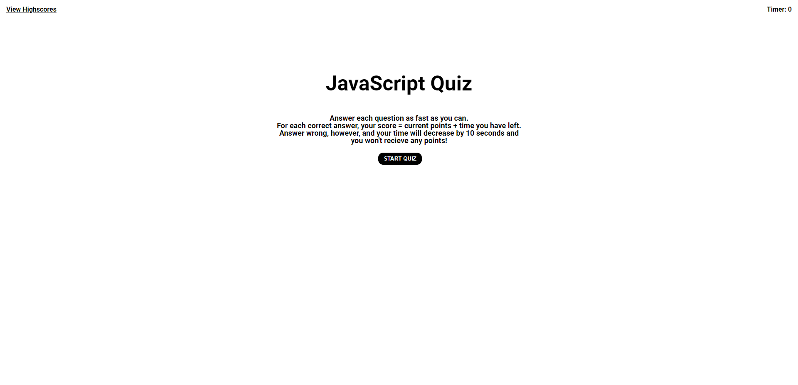
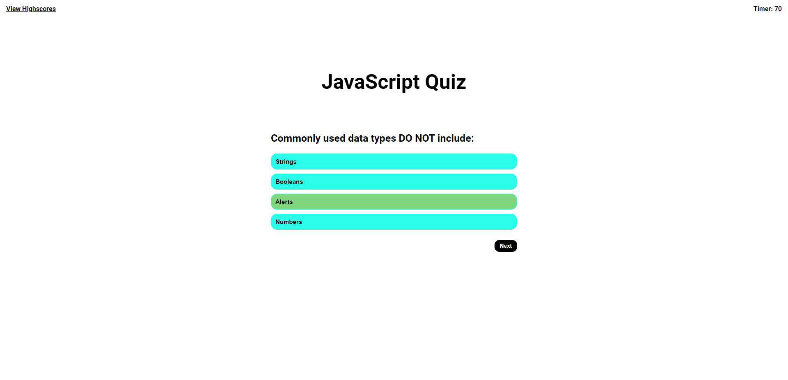
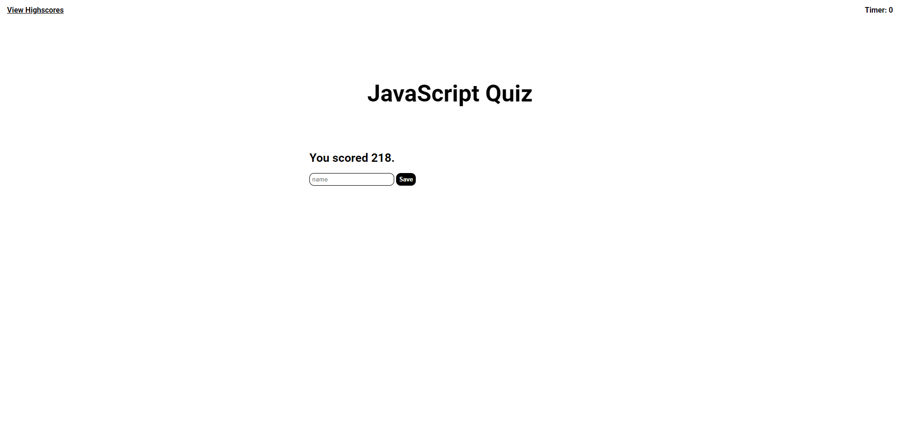
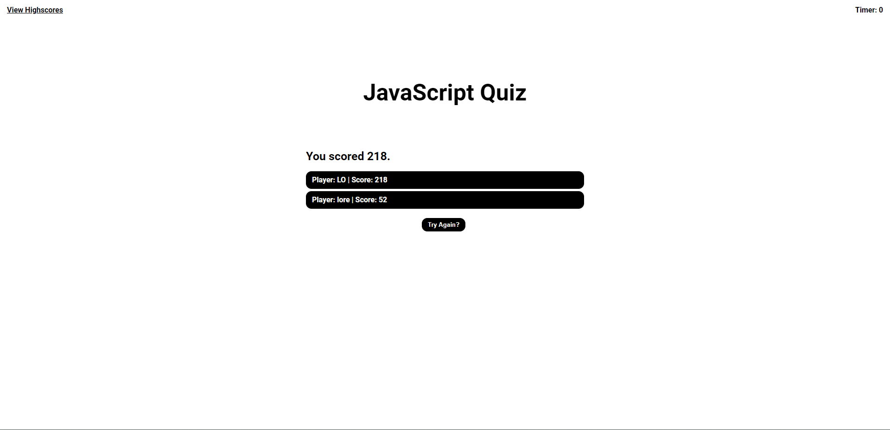
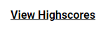

# Zo-JavaScript-Quiz

## Description

As a Developer,

I WANT to create a quiz about JavaScript code,

So that I can quiz the user on their knowledge of JavaScript.

## Installation

Proceed to this Link: 

## Usage

Click Start to start the Quiz

Click on what you believe is the correct answer

Type in your INITIALS and click SAVE

You should be able to see your top 5 high scores

Alternatively, you can click on view high scores to see your high scores if you have already logs a high score in

## License

MIT license
---
